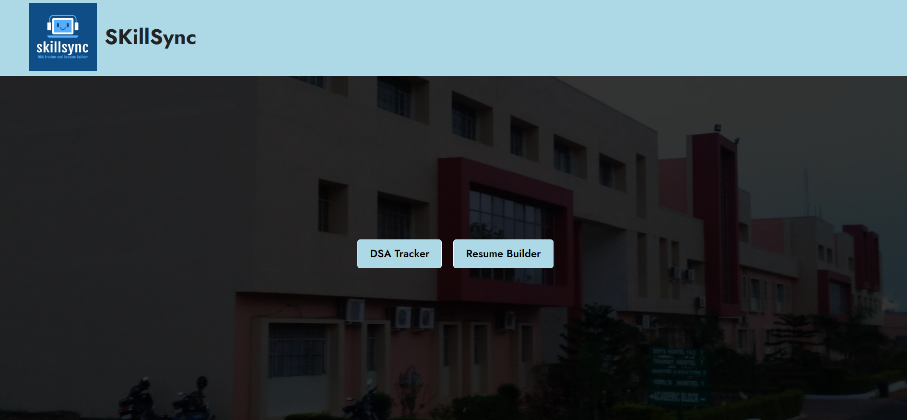

# SkillSync: Fostering Mastery in DSA and Professional Resume Building

Welcome to SkillSync, a comprehensive platform designed to empower students by seamlessly integrating the mastery of Data Structures and Algorithms (DSA) with the creation of professional resumes. Whether you're aspiring to enhance your coding skills or craft a compelling resume, SkillSync provides a unified environment to foster your academic and professional growth.

## DSA Tracker:

SkillSync's DSA Tracker offers a dynamic learning experience in the realm of Data Structures and Algorithms. Here's what you can do with the DSA Tracker:

- **Explore Topics:** Choose from a variety of DSA topics, ranging from fundamental concepts to advanced algorithms.
- **Solve Questions:** Practice coding with questions of varying difficulty levels and track your progress.
- **Save Notes:** Take detailed notes for specific questions to enhance your learning.
- **Bookmark Topics:** Bookmark topics for quick reference and revisit them whenever needed.
- **Search Functionality:** Easily find specific questions using the search feature.
- **Theme Customization:** Personalize your learning environment with light and dark theme options.

Explore the DSA Tracker [here](https://all-in-one-dsa.netlify.app/).

GitHub Repository: [SkillSync DSA Tracker](https://github.com/pushkarraj7/dsa-tracker)

## Resume Builder:

SkillSync's Resume Builder simplifies the process of creating a professional resume. Here's what you can achieve with the Resume Builder:

- **Choose Templates:** Select from a variety of templates to create a visually appealing resume.
- **Customize Colors:** Personalize your resume with different color schemes to suit your style.
- **Edit Sections:** Easily update your experiences and details using an intuitive editor.
- **Export Data:** Save your resume data in JSON format for future edits.
- **Download as PDF:** Generate a polished PDF version of your resume for easy sharing.

Try out the Resume Builder [here](https://resuzme-builder.netlify.app/).

GitHub Repository: [SkillSync Resume Builder](https://github.com/pushkarraj7/resume-builder)

## Landing Page:

Above is a sneak peek of SkillSync's landing page, where you can seamlessly navigate between the DSA Tracker and Resume Builder. Experience the synergy of skill development and resume building in one unified platform.

For live access, visit [SkillSync Live](https://pushkarraj7.github.io/SkillSync/).

Feel free to explore the repositories, contribute to the project, and enhance your coding skills while crafting a standout resume with SkillSync!
